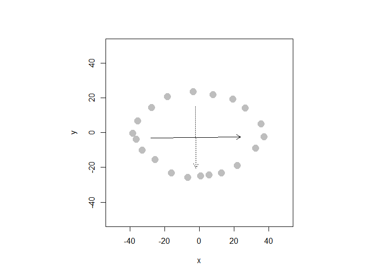
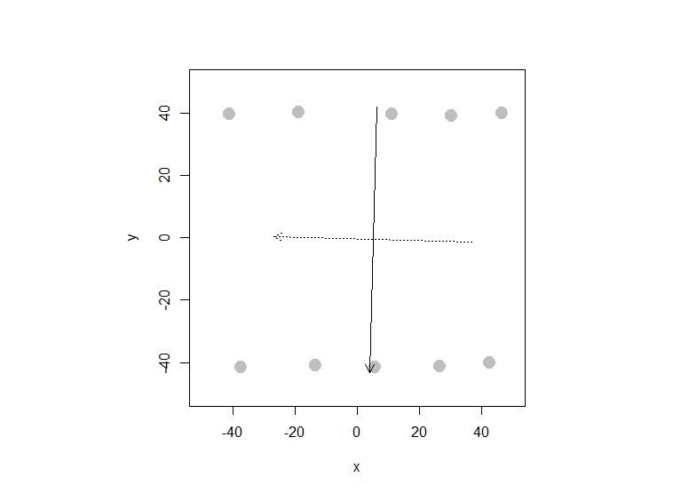

**109048231** helped me get to know that it is the ratios that are required in Question 1aii and Question 2a.

# Question 1

Let's revisit the issue of multicollinearity of main effects (between cylinders, displacement, horsepower, and weight) we saw in the cars dataset, and try to apply principal components to it. Start by recreating the cars_log dataset, which log-transforms all variables except model year and origin.

## 1a

Let's analyze the principal components of the four collinear variables

```{r, results="hold"}
cars <- read.table("auto-data.txt", header = FALSE, na.strings = "?")
cars1 <- na.omit(cars)
names(cars1) <- c("mpg", "cylinders", "displacement", "horsepower", "weight","acceleration", "model_year", "origin", "car_name")
cars1_log <- with(cars1, data.frame(log(mpg), log(cylinders), log(displacement), log(horsepower), log(weight), log(acceleration), model_year, origin))
```

### i

Create a new data.frame of the four log-transformed variables with high multicollinearity

```{r, results="hold"}
construct <- data.frame(cars1_log$log.cylinders.,cars1_log$log.displacement.,cars1_log$log.horsepower.,cars1_log$log.weight.)
```

### ii

How much variance of the four variables is explained by their first principal component?

```{r, results="hold"}
construct_eigen <- eigen(cov(construct))
eigen(cov(construct))$values[1]/sum(eigen(cov(construct))$values)
```

### iii

[**Question**]{.underline}

Looking at the values and valence (positiveness/negativeness) of the first principal component's eigenvector, what would you call the information captured by this component?

[**Answer**]{.underline}

each principal component's direction of variance (from Week 11 handout)

```{r, results="hold"}
construct_eigen$vectors
```

## 1b

### i

Store the scores of the first principal component as a new column of cars_log cars_log\$new_column_name \<- ...scores of PC1...

```{r, results="hold"}
cars1_log$construct <- construct_eigen$vectors[,1]
```

### ii

Regress mpg over the column with PC1 scores (replacing cylinders, displacement, horsepower, and weight), as well as acceleration, model_year and origin

```{r, results="hold"}
lm(log.mpg. ~ construct + log.acceleration.+ model_year + origin, data = cars1_log)
```

### iii

[**Instruction**]{.underline}

Try running the regression again over the same independent variables, but this time with everything standardized. How important is this new column relative to other columns?

[**Answer**]{.underline}

It appears important as its after-standardization coefficient (6.680e-03) outweigh other variables'.

```{r, results="hold"}
sdc <- data.frame(scale(cars1_log))
lm(log.mpg.~construct+log.acceleration.+model_year+origin,data=sdc)
```

# Question 2

A group of researchers is studying how customers who shopped on e-commerce websites over the winter holiday season perceived the security of their most recently used e-commerce site. Based on feedback from experts, the company has created eighteen questions (see 'questions' tab of excel file) regarding security considerations at e-commerce websites. Over 400 customers responded to these questions (see 'data' tab of Excel file). The researchers now wants to use the results of these eighteen questions to reveal if there are some underlying dimensions of people's perception of online security that effectively capture the variance of these eighteen questions. Let's analyze the principal components of the eighteen items.

## 2a

[**Question**]{.underline}

How much variance did each extracted factor explain?

[**Answer**]{.underline}

See "Cumulative Proportion" below

```{r, results="hold"}
sq <- read.csv('security_questions.csv')
pca <- prcomp(sq)
summary(pca)
```

## 2b

How many dimensions would you retain, according to the two criteria we discussed?

(Eigenvalue ≥ 1 and Scree Plot -- can you show the screenplot with eigenvalue=1 threshold?)

```{r, results="hold"}
sq2 <- (pca$sdev)^2
above_one <- sq2 >= 1 # Eigenvalue ≥ 1
below_one <- !above_one # Eigenvalue < 1
retained_dim <- sq2[above_one]
retained_dim
```

```{r, results="hold"}
screeplot(pca, type="lines")
abline(h=1,col='red',lty=3) # red line : eigenvalue = 1
```

## 2c

[**Question**]{.underline}

Can you interpret what any of the principal components mean? Try guessing the meaning of the first two or three PCs looking at the PC-vs-variable matrix (ungraded)

```{r, results="hold"}
pcs <- pca$rotation
pc1 <- pcs[,1]
pc2 <- pcs[,2]
```

```{r, results="hold"}
print("Principal Component 1:")
print(pc1)
```

```{r, results="hold"}
print("Principal Component 2:")
print(pc2)
```

[**Answer**]{.underline}

PC1 appear to be a general trend as the weights are all negative, hovering around -0.23.

PC2 has strong positive loadings for Q4 ,Q12, Q17. Based on the security-questions data, these questions are confidentiality-related.

# Question 3

Let's simulate how principal components behave interactively: run the interactive_pca() function from the compstatslib package we have used earlier:

## 3a

Create an oval shaped scatter plot of points that stretches in two directions -- you should find that the principal component vectors point in the major and minor directions of variance (dispersion). Show this visualization.

{width="555"}

```{r}
# compstatslib::interactive_pca()
# Click on the plot to create data points; hit [esc] to stop$points
#             x           y
# 1  -38.449096  -0.3139867
# 2  -35.594672   6.8220742
# 3  -27.602284  14.5290200
# 4  -18.468126  20.8087536
# 5   -3.625119  23.6631779
# 6    7.792578  21.9505233
# 7   19.210276  19.3815414
# 8   26.346337  14.2435775
# 9   35.480495   5.1094196
# 10  37.193149  -2.3120837
# 11  32.340628  -8.8772598
# 12  21.779258 -18.8677450
# 13  12.930542 -23.1493815
# 14   5.509039 -24.2911513
# 15   0.941960 -24.8620362
# 16  -6.764986 -25.7183635
# 17 -16.184586 -23.1493815
# 18 -25.604186 -15.4424358
# 19 -33.025690 -10.0190295
# 20 -36.450999  -3.7392959
# 
# $pca
# Standard deviations (1, .., p=2):
# [1] 25.79274 17.65758
# 
# Rotation (n x k) = (2 x 2):
#           PC1          PC2
# x 0.999967513  0.008060619
# y 0.008060619 -0.999967513
```

## 3b

Can you create a scatterplot whose principal component vectors do NOT seem to match the major directions of variance? Show this visualization.

{width="553"}

```{r}
# compstatslib::interactive_pca()
# Click on the plot to create data points; hit [esc] to stop$points
#             x         y
# 1  -41.303520  39.93340
# 2  -19.039010  40.50428
# 3   10.932445  39.93340
# 4   30.057088  39.36251
# 5   46.327307  40.21884
# 6   42.331113 -39.99049
# 7   26.346337 -41.13225
# 8    5.509039 -41.41770
# 9  -13.615604 -40.84681
# 10 -37.592769 -41.41770
# 
# $pca
# Standard deviations (1, .., p=2):
# [1] 42.67473 31.79428
# 
# Rotation (n x k) = (2 x 2):
#           PC1         PC2
# x -0.02676013 -0.99964188
# y -0.99964188  0.02676013
```
