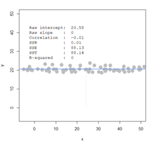
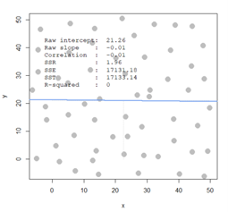
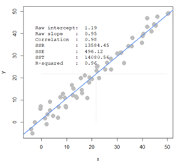
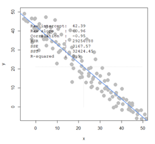
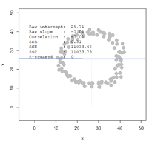
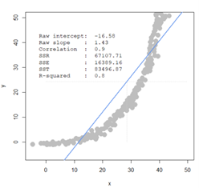
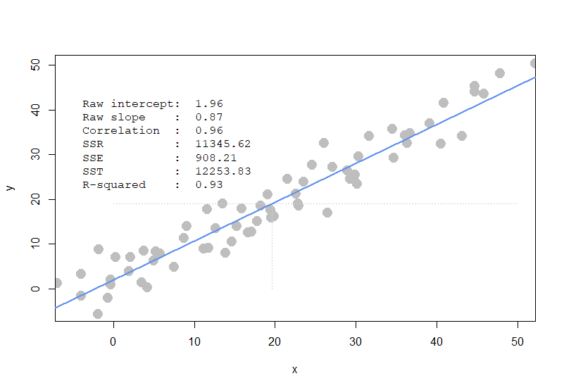

# Question 1

Let's make an automated recommendation system for the PicCollage mobile app

```{r, results='hold'}
library(data.table)
ac_bundles_dt <- fread("piccollage_accounts_bundles.csv")
ac_bundles_matrix <- as.matrix(ac_bundles_dt[, -1, with=FALSE])
```

## 1a

Let's explore to see if any sticker bundles seem intuitively similar:

### i

Download PicCollage onto your mobile from the App Store and take a look at the style and content of various bundles in their Sticker Store

### ii

Find a single sticker bundle that is both in our limited data set and also in the app's Sticker Store. Then, use your intuition to recommend five other bundles in our dataset that might have similar usage patterns as this bundle.

[**My Pick**]{.underline}

kung food

[**My Recommendations**]{.underline}

yummyfood, peanutman, food, icecreamsocial, and bananaman

## 1b

Let's find similar bundles using geometric models of similarity:

### i

Let's create cosine similarity based recommendations for all bundles

#### (1) Create a matrix or data.frame of the top 5 recommendations for all bundles

```{r, results='hold'}
rec_bundles_matrix <- ac_bundles_matrix[,c("yummyfood","peanutman", "food", "icecreamsocial", "bananaman")]
head(rec_bundles_matrix)
tail(rec_bundles_matrix)
```

#### (2) Create a new function that automates the above functionality: it should take an accounts-bundles matrix as a parameter, and return a data object with the top 5 recommendations for each bundle in our data set, using cosine similarity.

```{r, results='hold'}
library(lsa)

# Build auto_recommending function that takes bundles individually as the parameter
auto_recommend_by_cossim <- function(ac_bundles) {
  cos_sim <- cosine(as.matrix(ac_bundles))
  
  all_recommendations <- list()
  
  for (bundle_index in 1:ncol(ac_bundles)) {
    # Order by similarity in descending order, and exclude the first one (itself) and take the top 5
    similar_bundles_indices <- order(cos_sim[bundle_index, ], decreasing = TRUE)[2:6]
    
    # Get the names of the top 5 similar bundles
    similar_bundles_names <- colnames(ac_bundles_matrix)[similar_bundles_indices]
    
    all_recommendations[[colnames(ac_bundles)[bundle_index]]] <- similar_bundles_names
  }
  
  return(all_recommendations)
}

recommendations_by_cossim <- auto_recommend_by_cossim(ac_bundles_matrix)
```

#### (3) What are the top 5 recommendations for the bundle you chose to explore earlier?

```{r, results='hold'}
recommendations_by_cossim[["kungfood"]]
```

### ii

Let's create correlation based recommendations.

#### (1)(2) Reuse the function you created above. But this time give the function an accounts-bundles matrix where each bundle (column) has already been mean-centered in advance.

```{r, results='hold'}
mean_centered_matrix <- sweep(ac_bundles_matrix, 2, colMeans(ac_bundles_matrix), "-")
recommendations_by_corre <- auto_recommend_by_cossim(mean_centered_matrix)
```

#### (3) Now what are the top 5 recommendations for the bundle you chose to explore earlier?

```{r, results='hold'}
recommendations_by_corre[["kungfood"]]
```

### iii

#### (1)(2) Reuse the function you created above. But this time give the function an accounts-bundles matrix where each account (row) has already been mean-centered in advance.

```{r, results='hold'}
mean_centered_matrix <- sweep(ac_bundles_matrix, 1, rowMeans(ac_bundles_matrix), "-")
recommendations_by_adjcos <- auto_recommend_by_cossim(mean_centered_matrix)
```

#### (3) What are the top 5 recommendations for the bundle you chose to explore earlier?

```{r, results='hold'}
recommendations_by_adjcos[["kungfood"]]
```

## 1c

[**Question**]{.underline}

Are the three sets of geometric recommendations similar in nature (theme/keywords) to the recommendations you picked earlier using your intuition alone? What reasons might explain why your computational geometric recommendation models produce different results from your intuition?

[**Answer**]{.underline}

Not much. What I've done is merely picking some stickers whose name contains food, and I reckon that, judging from this tiny amount of numerical values, the computational geometric recommendation model might not be able to tell if the themes are food-related or not. Clearly, these models only treat column names as they already are, so it makes perfect sense why they've failed to pick out the same sticker bundles as my recommendations.

## 1d

[**Question**]{.underline}

What do you think is the conceptual difference in cosine similarity, correlation, and adjusted-cosine?

[**Answer**]{.underline}

Correlation is nothing but a mean-centered version of cosine similarity. However, the adjusted cosine method presents a radically different interpretation: the rows reflects each individual user's preference level to each sticker bundles, while the original cosine-similarity model examines how the sticker bundles are chosen separately.

# Question 2

Correlation is at the heart of many data analytic methods so let's explore it further.

[**Instruction**]{.underline}

For each of the scenarios below, create the described set of points in the simulation. You might have to create each scenario a few times to get a general sense of them. Visual the scenarios a - d shown below.

## 2a

[**Scenario A**]{.underline}

Create a horizontal set of random points, with a narrow but flat distribution.{width="400"}

### i

slope expected to be close to 0

### ii

correlation expected to be 0

## 2b

[**Scenario B**]{.underline}

Create a random set of points to fill the entire plotting area, along both x-axis and y-axis

{width="400"}

### i

slope expected to vary greatly

### ii

correlation expected to be 0

## 2c

[**Scenario C**]{.underline}

Create a diagonal set of random points trending upwards at 45 degrees

{width="400"}

### i

slope expected to be close to 1

### ii

correlation expected to be 1

## 2d

[**Scenario D**]{.underline}

Create a diagonal set of random trending downwards at 45 degrees

{width="400"}

### i

slope expected to be close to -1

### ii

correlation expected to be -1

## 2e

[**Question**]{.underline}

Apart from any of the above scenarios, find another pattern of data points with no correlation (r ≈ 0)

{width="399"}

[**Answer**]{.underline}

Any pattern resembling a circle or an ellipse centered at origin can give a correlation of 0

## 2f

[**Question**]{.underline}

Apart from any of the above scenarios, find another pattern of data points with perfect correlation (r ≈ 1).

{width="400"}

[**Answer**]{.underline}

The exponential function can have a correlation close to 1

## 2g

[**Instruction**]{.underline}

Let's see how correlation relates to simple regression, by simulating any linear relationship you wish

### i

Run the simulation and record the points you create: pts \<- interactive_regression()

```{r, results='hold'}
# Perform on Console
# pts <- interactive_regression()

# Store the dataframe manually
pts <- data.frame(
  x = c(-0.2945627, 4.2347352, 3.5379201, 1.9700862, 8.7640331, 19.4775647, 30.3653, 39.1625902, 45.8694352, 40.9046278, 
        21.5680099, 5.8025691, -3.9528418, -0.6429703, 26.5328172, 18.2581383, 15.2966743, 28.9716699, 23.5713532, 29.9297906, 
        34.5461904, 27.1425304, 36.1140243, 31.6718283, 40.5562203, 52.2278726, 44.7371107, 36.3753299, 29.3200774, 7.5446067, 
        19.9130741, 15.9063875, 11.812599, 12.6836178, 11.6383952, -0.2945627, -1.8623966, 22.96164, 22.8745381, 26.0973078, 
        29.7555868, 36.7237375, 44.7371107, 47.8727785, 43.1692768, 34.7203942, 30.1910963, 13.9030442, 2.14429, -6.9143058, 
        9.1124406, 24.6165758, 22.6132324, 3.7992258, 0.3151504, -1.7752947, -3.9528418, 11.2028858, 14.6869611, 19.1291571, 
        13.5546366, 5.0186521, 5.2799578, 19.5646665, 17.8226289, 17.1258138, 16.6903044),
  y = c(0.8404706, 0.2108332, 1.3126987, 3.8312487, 11.2294891, 17.5258639, 29.488976, 36.8872165, 43.49841, 41.4520882, 
        24.4518762, 7.7664829, -1.6780793, -2.1503074, 16.8962264, 18.4703201, 13.9054484, 26.3407886, 23.8222387, 25.3963324, 
        35.6279415, 27.1278355, 34.2112572, 34.0538478, 32.3223447, 50.2670129, 43.9706381, 32.4797541, 24.4518762, 4.7757049, 
        16.1091796, 17.8406826, 9.0257579, 13.4332203, 17.6832733, 1.9423362, -5.7707229, 18.4703201, 18.9425482, 32.4797541, 
        24.6092856, 34.6834853, 45.2299131, 48.0632817, 34.0538478, 29.1741573, 23.3500106, 7.9238923, 6.9794361, 1.1552894, 
        13.9054484, 27.6000636, 21.1462794, 8.3961204, 6.9794361, 8.7109392, 3.2016112, 8.8683485, 10.4424422, 20.98887, 
        18.9425482, 6.1923892, 8.238711, 15.7943608, 15.007314, 12.6461734, 12.488764)
)

```

### {width="544"}ii

Use the lm() function to estimate the regression intercept and slope of pts to ensure they are the same as the values reported in the simulation plot: summary( lm( pts\$y \~ pts\$x ))

```{r, results='hold'}
summary(lm(pts$y~pts$x))
```

[**What's Observed**]{.underline}

The result aligns with the reported values in the plot.

### iii

Estimate the correlation of x and y to see it is the same as reported in the plot: cor(pts)

```{r, results='hold'}
cor(pts)
```

[**What's Observed**]{.underline}

The result aligns with the reported values in the plot.

### iv

Now, standardize the values of both x and y from pts and re-estimate the regression slope

```{r, results='hold'}
pts_standardized <- as.data.frame(scale(pts))
summary(lm(pts_standardized$y~pts_standardized$x))
```

[**What's Observed**]{.underline}

The slope turns out to be the coefficient pts_standardized\$x, which is equal to around 0.96

### v

[**Question**]{.underline}

What is the relationship between correlation and the standardized simple-regression estimates?

[**Answer**]{.underline}

The correlation between x and y is directly equal to the slope of the regression line when both variables are standardized.
